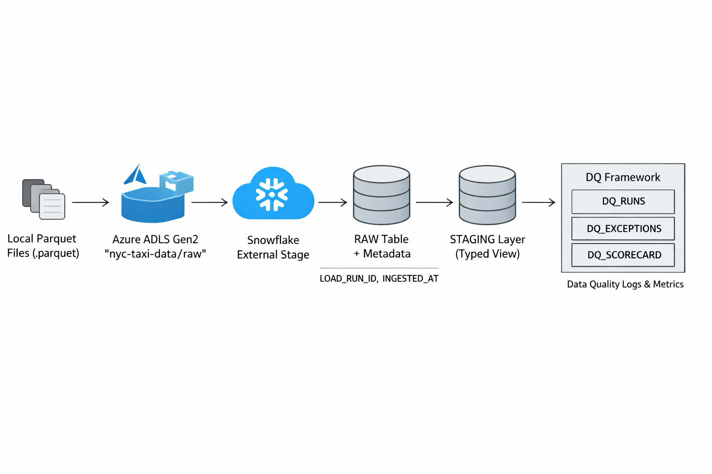
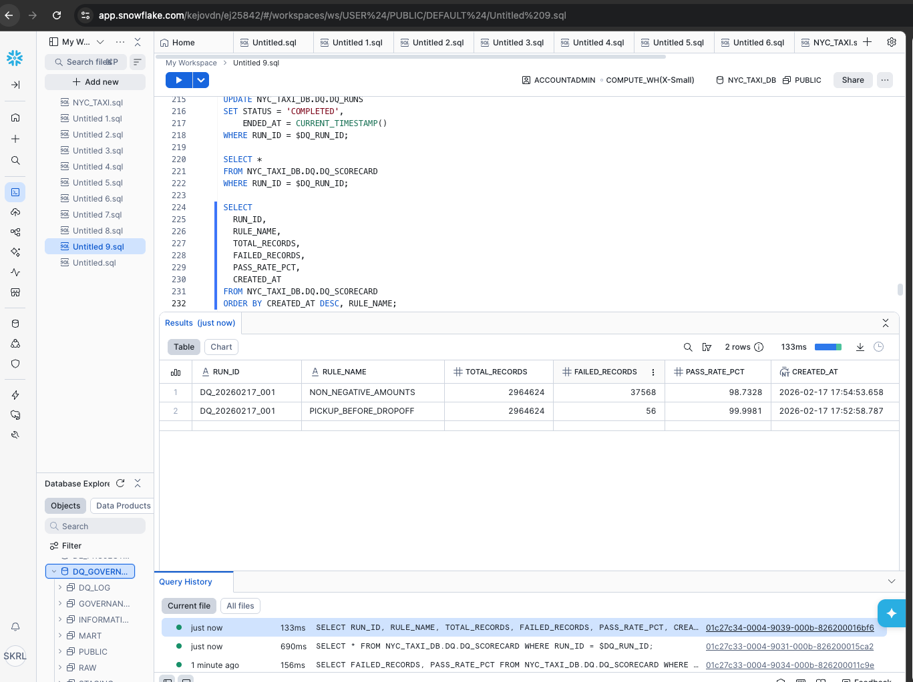
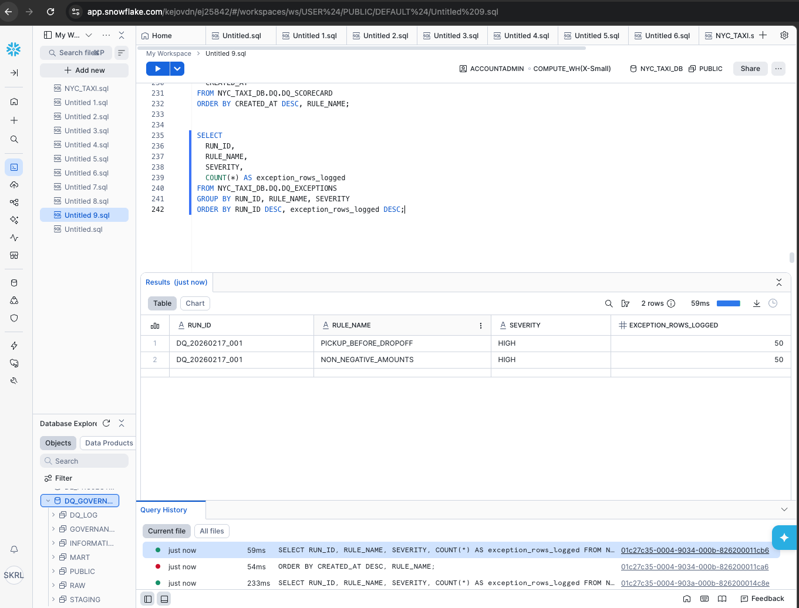
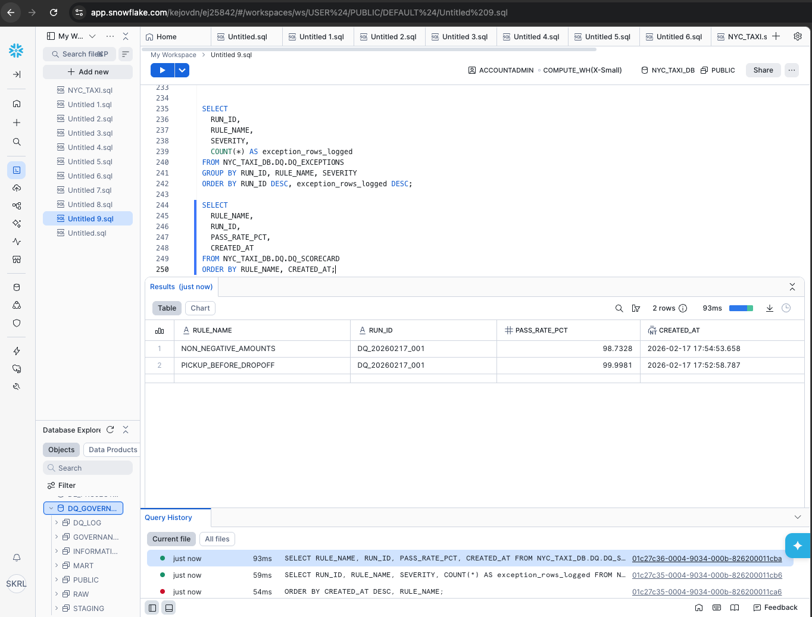

# Project 2 — NYC Taxi Parquet Ingestion + Data Quality Scorecards (Azure ADLS → Snowflake)

## Overview
Enterprise-style pipeline that ingests **NYC Yellow Taxi trip data (Parquet)** from **Azure Data Lake Storage Gen2** into **Snowflake**, builds a typed **STAGING** layer, and runs a **Data Quality framework** with run-control, exception logging, and scorecards.

This project demonstrates real production patterns:
- Cloud landing zone
- External stages
- Batch metadata tracking
- RAW → STAGING modeling
- DQ monitoring with pass-rate metrics and exception samples

---

## Architecture
Local Parquet → Azure ADLS Gen2 (`nyc-taxi-data/raw`) → Snowflake External Stage → RAW (VARIANT + metadata) → STAGING (typed view) → DQ (runs/exceptions/scorecards)

---

## Tech Stack
- **Azure ADLS Gen2** (storage landing zone)
- **Snowflake** (warehouse)
- **SQL** (ingestion + transformations + DQ)
- **Git + GitHub** (version control + portfolio)

---

## Data Quality Framework (Enterprise Pattern)
Tables:
- `NYC_TAXI_DB.DQ.DQ_RUNS` — run control (STARTED/COMPLETED)
- `NYC_TAXI_DB.DQ.DQ_EXCEPTIONS` — row-level exception samples (VARIANT payload)
- `NYC_TAXI_DB.DQ.DQ_SCORECARD` — rule-level metrics (pass rate, failed records)

DQ Rules Implemented:
1. **PICKUP_BEFORE_DROPOFF**
   - pickup timestamp must be <= dropoff timestamp
2. **NON_NEGATIVE_AMOUNTS**
   - fare/tip/tolls/total must be non-negative

---

## Results Snapshot (from scorecards)
- Rule 1 (Pickup before dropoff): **56 failures**, **99.9981% pass rate**
- Rule 2 (Non-negative amounts): **37,568 failures**, **98.7328% pass rate**

> Note: Negative amounts can represent real-world refunds/adjustments — the framework surfaces these for investigation..

---

## Screenshots (Proof)
### Scorecards (latest)

### Exceptions Summary

### Pass-rate Trend

---

## Repository Structure
- `sql/` — Snowflake SQL scripts (stage, RAW load, STAGING view, DQ rules)
- `screenshots/` — evidence of scorecards/exceptions/trend outputs
- `data/` — local zones (`selected/` ignored via `.gitignore`)

---

## How to Reproduce (High Level)
1. Upload Parquet file to Azure ADLS container `nyc-taxi-data/raw`
2. Create Snowflake database/schemas: `NYC_TAXI_DB.RAW`, `NYC_TAXI_DB.STAGING`, `NYC_TAXI_DB.DQ`
3. Create `PARQUET_FORMAT` + external stage pointing to Azure
4. Load into RAW table with batch metadata (`LOAD_RUN_ID`, `INGESTED_AT`)
5. Create STAGING typed view `V_NYC_TAXI_TRIPS_STG`
6. Run DQ rule scripts to populate `DQ_EXCEPTIONS` + `DQ_SCORECARD`

---

## Author
Sreyas
